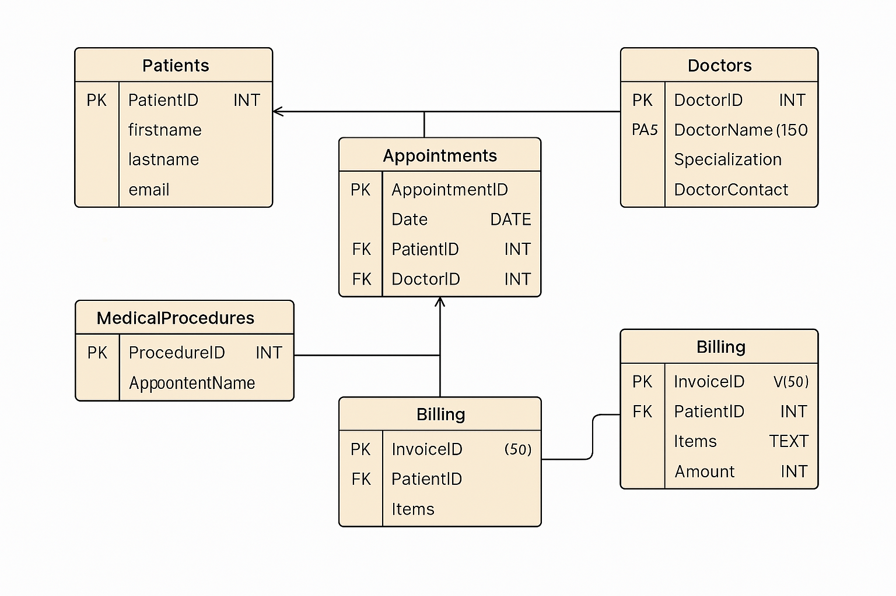

# Healthcare Management System (SQL Project)

This project is a relational database system designed to manage patients, doctors, appointments, medical procedures, and billing data in a healthcare environment. Built entirely using SQL, it features a normalized schema, real-world query examples, and testable data flows that simulate hospital operations.

Dataset used: https://www.kaggle.com/datasets/anouskaabhisikta/healthcare-management-system

---

## Project Structure

- `schema.sql`: SQL DDL file to create all database tables
- `queries.sql`: Practical queries for reporting, analytics, and tracking
- `insert_data.sql`: Insert sample/mock data here

---

## Schema Overview

| Table               | Description                                     |
|--------------------|-------------------------------------------------|
| `Patients`          | Stores personal information about patients      |
| `Doctors`           | Contains doctor profiles and contact info       |
| `Appointments`      | Connects patients and doctors for a date/time   |
| `MedicalProcedures` | Procedures linked to appointments               |
| `Billing`           | Tracks charges per patient                      |

---

## Key Queries Included

| # | Description                                         |
|---|-----------------------------------------------------|
| 1 | List all appointments for a specific patient        |
| 2 | Daily appointment counts                            |
| 3 | Most active doctors by number of appointments       |
| 4 | Total billing per patient                           |
| 5 | Most common medical procedures                      |
| 6 | Upcoming appointments (future dates only)           |
| 7 | Patients who’ve seen more than one doctor           |
| 8 | Doctor billing performance                          |
| 9 | Unusually high billing items                        |
| 10| Billing grouped by procedure and appointment date   |

---

## Tools Used

- PostgreSQL (recommended)
- DBeaver or pgAdmin (for SQL execution & ERD)
- Python (optional, for CSV preprocessing)
- dbdiagram.io or drawSQL (for ER diagram)

---

## How to Use

1. Load `schema.sql` into your SQL environment to create the tables.
2. (Optional) Use `insert_data.sql` to load test data.
3. Run `queries.sql` to see sample insights and reports.

---

## Future Improvements

- Add user authentication (admin vs. patient)
- Include lab results & medications tables
- Build a dashboard using Python (Streamlit or Flask)

